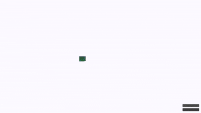
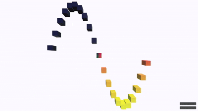

# 유니티 연습장입니다.

## 1. Graph

  

  
DAY 1

   

   

  

  

  
DAY 2

   

   

  

  

  
DAY 3

  ### 유니테스크와 보간함수를 사용한 그래프 변화
   

  ### 상황에 맞게 테스크를 조종하였다.
  

  

 

  
DAY 4

  ### 오브젝트의 Transform 정보를 cpu를 거치지 않고 바로 gpu로 갈 수 있게 하여 많은 오브젝트를 생성함에도 비교적 높은 fps를 확보하였다.
  

